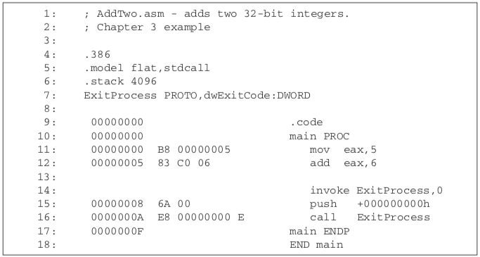
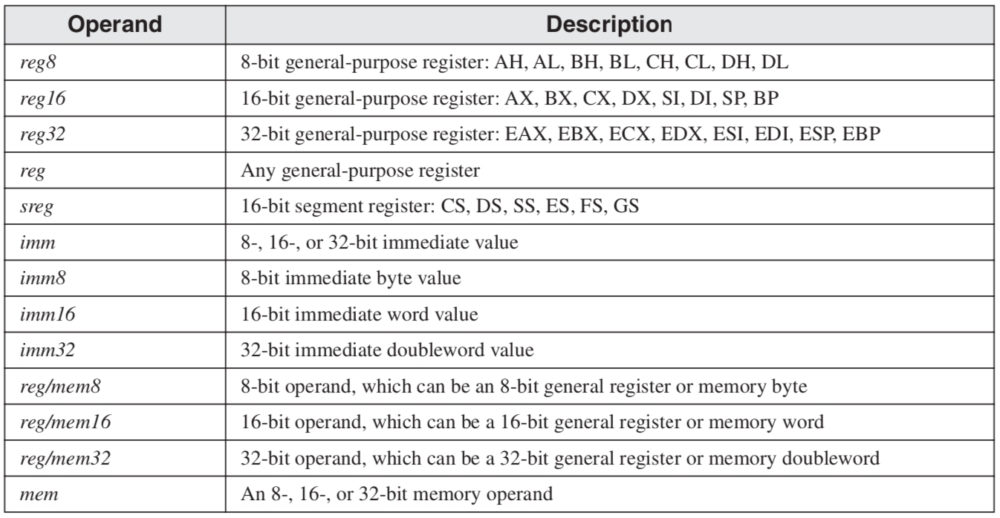

<a name="top"></a>
## Table of Contents
<ul>
	<li><a href="#basic">Basic</a></li>
	<li><a href="#registers">Registers<a/></li>
	<li><a href="#instructions">Instructions<a/></li>
</ul>

<a name="basic"></a>
## Basic Elements
- Register Type
	- AX: Accumulator
		- Used in input/output and most arithmetic instructions. (e.g. store an operand)
	- BX: Base
		- could be used in indexed addressing
	- CX: Count
		- store loop count
	- DX: data
		- used in input/output operations. Also used with AX along with DX for multiply and divide operations involving large values

- EAX: E stands for extended, 32 bit AX
- RAX: R means 64 bit version register

		
```assembly
.stack 4096
ExitProcess PROTO, dwExitCode:DWORD

.data							; data segment
sum DWORD 0						; 32 bits

.code							; code segment
main PROC
	mov eax, 5					; move 5 to the eax register
	add eax, 6					; add 6 to the eax register
	
	INVOKE ExitProcess, 0		; end the program
main ENDP


```
#### Types
- Integer literal (constant)

```assembly
26			; decimal
26d			; decimal
11010011b	; decimal
42q			; octal
42o			; octal
1Ah			; hexadecimal

```

- Operators

|Operator|Precedence|
|:--:|:--:|
|()|1|
|+, -(unary)|2|
|*, /|3|
|MOD|3|
|+,-|4|

- Real Numbers

```assembly
2.
+3.0
-44.2E+05
```
- Character and String Literals

```assembly
'A'
"d"		; single or double quote, they are the same
"Good night, Gracie"
'ABC'
```

- Reserved Words

```assembly
MOV
ADD
MUL
BYTE
WORD
DWORD
```

- Identifiers
	- not case sensitive
	- first character must be a letter (A..Z, a..z), underscore, @, ?, $ (Not digit)
	- can't be the same as reserved words

- Directives

```assembly
.data			; case insensitive
.code
.stack 100h	; size of the stack, to holde passed params and address of the code that called the function, as well as the local variables
.386 			; identifies this as a 32-bit program that can access 32-bit registers and addresses
.model flat, stdcall	
; memory model flat: 32-bit programs always use flat memory model which is associated with the processor's protected mode, calling convention 
```


- Label

```assembly

; data labels
cout DWORD 100	; data label
array DWORD 1024, 2048
      DWORD 4096, 8192
      
; code labels
target:
	mov ax,bx
	...
	jmp target

L1: move ax,bx
l2:
```

- Instruction Mnemonic

|Mnemonic|Descriptoin|
|:--:|:--|
|MOV|move the last to the first|
|ADD||
|SUB||
|MUL||
|JMP||
|CALL||
|STC|set Carry flag|
|INC|add 1|
|IMUL|multiply the later 2, save to the first|

- Comments

```assembly
COMMENT !
	This line is a comment.
	This line is also a comment.
!
```
- ! is a user specified character, we can use others as long as it does not appear in the code

- Prototype
```assembly
; ExitProcess is a standard Windows service
ExitProcess PROTO, dwExitCode:DWORD	; input param: dwExitCode type DWORD
```
- Running programs


- Listing file

	- 00000000 is the relative start address of the code
	- B8, 83 is machine code instruction, 00000005 is the value

- Defining data

```assembly
list BYTE 10, 20, 30, 40

list BYTE 10, 20, 30, 40
     BYTE 50, 60, 70, 80
     
greeting1 BYTE "Good afternoon", 0 ; 0 terminate the string
greeting1 BYTE 'G', 'o', 'o' ......

; long string divided in to multiple lines
greeting1 BYTE "Welcome to the Encryption Demo program "
			BYTE "If you with to modify this program, please "
			
greeting1 BYTE 20 DUP(0)	; 20bytes, all zero
greeting1 BYTE 20 DUP(?)	; 20bytes, uninitialized
greeting1 BYTE 4 DUP("STACK")	; 20bytes:"STACKSTACKSTACKSTACK"

world2 SWORD ? ; uninitialized, signed value
mylist WORD 1,2,3,4,5	; a list with 1,2,3,4,5

; floating point
rVal1 	REAL4 -1.2	;4bytes real number
rVal2	REAL8 3.2E-260
rVal3	REAL10 4.6E+4096
ShortArray  REAL4 20 DUP(0.0)

rVal1 DD -1.2			; short real
rVal2 DQ 3.2E-260	; long real
rVal3 DT 4.6E+4096	; extended-precision real


COMMENT !
Packed BCD data, 10-byte package, 
Highest byte: 80h negative, 00h, positive
can be defined only by Hexadecimal form
!
intVal TBYTE 800000000000001234h 

; real number
.data
posVal REAL8 1.5
bcdVal TBYTE ?

.code
fld posVal	; load onto floating-point stack
fbstp bcdVal	; rounds up to 2 as packed BCD

```

- Little-Endian Order(x86)


- Big-Endian Order(x86)


- Symbolic Constants
	- doesn't use storage, value won't change at runtime, like reference
```assembly
COUNT = 500
mov eax, COUNT	; will be translated to move eax, 500


COUNT = 5
array dword COUNT DUP(0)
```

- Current Location Counter ($)
```assembly
selfPtr DWORD $	; save the current address in selfPtr

list WORD 10, 20, 30, 40
ListSize = ($ - list)/2		; calculate list size (current location - the list location)
```

- EQU
	- like "=" symbol can not be redefined later

	
```assembly
name EQU expression
name EQU symbol
name EQU <text>

mat1 EQU 10 * 10
mat2 EQU <10 * 10>
.data
M1 WORD mat1	; 100
M2 WORD mat2	; 10 * 10

```

- TEXTEQU
	- can build on each other

```assembly
	rowSize = 5
	count TEXTEQU %(rowSize * 2)
	move  TEXTEQU	 <mov>
	setupAL TEXTEQU <move al, count>	; move al, 10
```


- OFFSET Operator
get the relative address of the a variable in this segment

```assembly
.DATA
bVal BYTE ?	; Assume bVal is at 00404000h
wVal WORD ?

.CODE
mov esi, OFFSET bVal	; ESI = 00404000h
mov esi, OFFSET wVal	; ESI = 00404001h

```

- ALIGN directive

```assembly
.DATA
b1 BYTE ?	; address 00404000h
ALIGN 2	; skip one byte
w1 WORD ?	; address 00404002h
w2 WORD ? ; address 00404004h
ALIGN 4	; skip two bytes
d1 DWORD ?; address = 00404008h
```


- TYPE Operator
Size in bytes, of a single element of a data declaration

``` assembly
.DATA
var1 BYTE ?
var2 WORD ?

.CODE
mov eax, TYPE var1	; eax = 1
mov eax, TYPE var2 ; eax = 2
```

- LENGTH Operator
# of elements in a single data declaration

``` assembly
.DATA
array1 DWORD 1, 2, 3, 4
array2 BYTE "123456", 0
array3 WORD 5 DUP(3 DUP(?))

.CODE
mov eax, LENGTHOF array1	; eax = 4
mov eax, LENGTHOF array2 	; eax = 2
mov eax, LENGTHOF array3	; eax = 15
```

- SIZEOF Operator
TYPE * LENGTHOF

- Multiple Line Declarations

``` assembly
.DATA
array WORD 10, 20,
			 30, 40,
			 50, 60
			 
.CODE
mov eax, LENGTHOF array	; 6
mov ebx, SIZEOF array		; 12

;example 2

.DATA
array 	WORD 10, 20
	 	WORD 30, 40
	 	WORD 50, 60

.CODE
mov eax, LENGTHOF array		; 2
mov ebx, SIZEOF array		; 4	
```

- PTR Operator
variable type that store the first * bytes of address

``` assembly
.DATA
dval DWORD 12345678h
array BYTE 00h, 10y, 20h, 30h

.CODE
mov al, dval					; error al 1byte
mov al, BYTE PTR dval		; al = 78h
mov ax, dval					; error
mov ax, WORD PTR dval		; ax = 5678h
mov eax, array				; error
mov eax, DWORD PTR array	; eax = 30201000h
```


- LABEL Directive
	- LABEL does not allocate any storage of its own
	- Can remove the need for the PTR operator
``` assembly
.DATA
dval LABEL DWORD
wval LABEL WORD
blist BYTE 00h, 10h, 00h, 20h

.CODE
mov eax, dval		; eax = 20001000h
mov cx, wval		; cx = 1000h
mov dl, blist		; dl = 00h
```

<a href="#top">Back To Top</a>
<a name="registers"></a>

## Registers

- 32 Bit Registers


- EAX
	- AX: lower 16 bits of EAX
	- AH: higher 8 bits of AX
	- AL: lower 8 bits of AX

- EFLAGS Register


- Operand



<a href="#top">Back To Top</a>
<a name="instructions"></a>

## Instructions
- MOVZX
	- Fills the upper part of the destination with zeros


``` assembly
mov b1, 8Fh
```
- MOVSX
	- Fills the upper part of destination with sign bit

- LAHF and SAHF
	- LAHF: Copy the low byte of EFLAGS register to AH
	- SAHF: Copy AH into the low byte of EFLAGS
	- Copied flags: Sign, Zero, Auxiliary Carry, Parity, and Carry.
	
- XCHG
	- Exchanges the contents of two operands.

``` assembly
XCHG ax, bx
```

- Direct-Offset Operands
	- can access random memory out of the variable

	
``` assembly
arrayB BYTE 10h, 20h, 30h, 40h, 50h

mov al, arrayB		; AL = 10h
mov al, [arrayB+1]	; AL = 20h
mov al, arrayB+1	; AL = 20h
mov al, arrayB[1]	; AL = 20h
```

- INC, DEC, ADD, SUB, NEG

``` assembly
.data
var1 WORD 1000h
var2 WORD 2000h

.code
inc var1	; var1 = 1001h
dec var1	; var1 = 1000h

mov eax, var2 ; eax = 2000h
sub eax, var1 ; eax = 2000h-1000h

neg var1	; var1 = -1000h
```


- Flags

Flags|Usage|Note
|:--:|:--|:--
Carry|Set when unsigned arithmetic result is out of range|The carry out of the most significant bit, it's the borrow flag when subtracting
Overflow|Same as above| When adding 2 positive operands are added and the sum is negative or vice versa, it won't happen when adding a positive and a negative operand. For A-B, it'll set if A and B have different signs and sign of result not = sign of A
Sign|Copy of sign bit|
Zero Flag|Set when result is Zero|
Auxiliary Carry|Set when there's a carry from bit 3 to bit 4| 00001111 + 00000001 or 00001000 - 00000010 ; AC = 1
Parity|Set when parity in least-significant byte is even|

