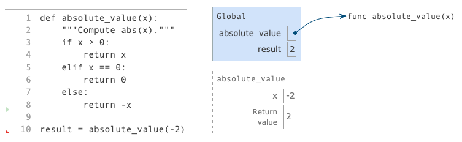
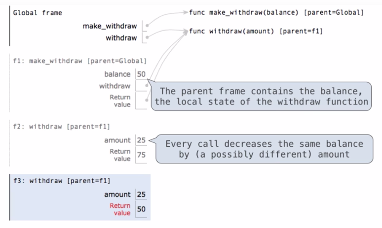

<a name="top"></a>
## Table of Contents
<ul>
    <li><a href="#useful_command">Useful Command</a></li>
    <li><a href="#expressions">Expressions</a></li>
    <li><a href="#functions">Functions</a>        
        <ul>
            <li><a href="#environment_diagrams">Environment Diagrams</a></li>
            <li><a href="#funcs">Functions</a></li>
        </ul>
    </li>
    <li><a href="#testing">Testing</a></li>
    <li><a href="#control">Control</a></li>
    <li><a href="#lambda">Lambda</a></li>
    <li><a href="#higher_order_funcs">Higher order Functions</a></li>
    <li><a href="#recursive_functions">Recursive Functions</a></li>
    <li><a href="#data_abstraction">Data Abstraction</a></li>
    <li><a href="#built-in_types">Built-in Types</a></li>
    <li><a href="#trees">Trees</a></li>
    <li><a href="#mutable">Mutable Sequence</a></li>
    <li><a href="#program_decomposition_debugging">Program Decomposition & Debugging</a></li>
    <li><a href="#mutable_funcs_and_none_local">Multable Functions & None Local</a></li>
    <li><a href="#iterators">Iterators</a></li>
    <li><a href="#growth">Measuring Growth</a></li>
    <li><a href="#objects">Object Oriented Programming</a></li>
    <li><a href="#linked_lists">Linked List, Tree and Property Methods</a></li>
    <li><a href="#magic_methods">Magic Methods</a></li>
    <li><a href="#miscellaneous">miscellaneous</a></li>
</ul>

<a name="useful_command"></a>
## useful commands

```python
python3 -i lab00.py         //open interactive shell with this module
python3 -m doctest lab00.py //run doctests inside the file

//doctest example
"""
>>> twenty_nineteen()
2019
"""


```

<a name="expressions"></a>
## Expressions

```python
shakes = open('shakespeare.txt')    #open file
text = shakes.read().split()       
text.count('the')                   #count the number of apperence 'the'
words = set(text)
'the' in words                      #the value is a boolean 'True'

'draw'[::-1]                        #reverse the word, the last :-1 means step -1 (when it's negative, 
                                    #It means starting from the end
w = "the"
words = set(open('/usr/share/dict/words').read().split())   #open the default dictionary in mac
{w for w in words if w[::-1] == w and len(w) == 4}          #evaluated to a list of palindrome

7//4    #divide 7 by 4 and floor the result

```

<a href="#top">return to the top</a>


<a name="functions"></a>
## Functions

```python
ctrl+l //clear the screen

from math import pi
from math import sin
sin(pi/2)

f = max
f(1,2,3)    //return 3

from operator import add, mul
```

#### Ways to bind a name
- import
- assignment
- def statement

"def" statement e.g.
```python
def square(x):
    return mul(x, x)
```

#### Types of Expressions
- Primitve expressions(2 add 'hello')
    - Number or Numeral (e.g. 2)
    - Name (e.g. add)
    - String (e.g. 'hello')
- Call expressions(max(2, 3))
    - operator (e.g. max)
    - operand( e.g. 2 | 3)

<a name="environment_diagrams"></a>
#### Environment Diagrams


#### Execution rule for assignment statements:
1. Evaluate all expressions to the right of = from left to right.
2. Bind all names to the left of = to the resulting values in the current frame.


<a name="funcs"></a>
#### Functions

#### Means of Abstraction
- Assignment
- Function definition



<a href="#top">return to the top</a>

<a name="testing"></a>
## Testing

#### Assertions
```python
assert fib(8) == 13, 'The 8th Fib number should be 13'
```
If the expression is
- True, nothing will happen
- False, it will cause an error, halt the execution and print the message

#### Doctests
```python
"""
>>> sum_nat(10)
55
>>> sum_nat(100)
5050
"""
```

Run Tests
1. Run all the tests
```python
>>> from doctest import testmod
>>> testmod() //run all the tests
```
2. run specific function test
```python
>>> from doctest import run_docstring_examples
>>> run_docstring_examples(sum_nat, globals(), True)    //sum_nat: function name, globals(): get global environment, True: show verbose
```

3. Run all the tests in a file
```shell
python3 -m doctest <python_source_file>
```
<a href="#top">return to the top</a>

<a name="control"></a>
## Control

#### Print
```python
print(1,2,3)
1 2 3

print(None, None)
None None

print(print(1), print(2))
1
2
None None
```

#### Miscellaneous Python Feature
```python
2013 // 10  //truediv div and ignore the reminder (floordiv)
2013 % 10   //mod(2013, 10)
```

##### Compound Statements


<a href="#top">return to the top</a>

<a name="lambda"></a>
## Lambda

#### Lambda Expressions
```python
(lamdda x: x*x)(3)      //call lambda function with arguement 3

square = lambda x: x*x
square(4)               //return 16
```

**Difference between def ~ and lambda**
- function has a name when using def

```python
//using lambda
>>> square
<function <lambda> at 0x1003c1bf8>

//using def
>>> square
<function square at 0x10293e730>
```


<a href="#top">return to the top</a>

<a name="week1_miscellaneous"></a>
## week1 miscellaneous
```python
>>>19 and 21
21
```

- inner call goes first because operands must be evaluated before calling a function
```python
def yes(guess):
    if guess == 'yes':
        return 'yes'
    return 'no'

def go(x):
    return x + yes(x)

go(go('yes'))

"""
f global
f1 go(inside)
f2 yes
f3 go(outside)
f4 yes
"""
```

- There is no quotes for the output of print function but there is quotes if a string is returned

```python
>>> print('fuck')
fuck

>>> 'fuck'
'fuck'
```

- There is no difference between single and double quotes in python

**''(empty string), 0,  False, None means False**
- always prefer to show the latest one
- show nothing if None
- show only what evaluated 
- comparison operator(like >) has higher priorities than the keywords: and, or

```python
>>> -3 and True
True
>>> True and -3
-3

>>> False or None

>>> None or False
False

>>> True or 3
True

>>> 3 or True
3

>>> False and ''
False

>>> '' and False
''

>>> 1 or 0==0
1
```

- variables passed in as parameters can be changed directly
```python
def say(s0):
    for i in range(10):
        s0 += 1
    return s0
```

- print
```python
>>> print(10, 20)
10 20
```

<a href="#top">return to the top</a>

<a name="higher_order_funcs"></a>
## Higher-order function: 
- A function that takes a function as an arguement or returns a function
- A function's domain is the set of all inputs it might possibly take as arguments.
- A function's range is the set of output values it might possibly return.
- A function's behavior is the relationship it creates between input and output.


```python
#return a function
"""
>>> adder = make_adder(3)
>>> adder(4)
7
"""

def make_adder(n):
    def adder(k):
        return k + n
    return adder


>>> make_adder(1)(3)
>>> 4
```


<a href="#top">return to the top</a>

<a name="recursive_functions"></a>
## Recursive Functions
- A function is called recursive if the body of that function calls itself, eighter directly or indirectly.

```python
def fact_iter(n):
    total, k = 1, 1
    while k <= n:
        total, k = total*k, k+1
    return total
```
$`n! = \prod\limits_{k=1}^n k`$

```python
def fact(n):
    if n == 0:
        return 1
    else:
        return n * fact(n - 1)  
```


#### Tree Recursion
```python
#like a true
def fib(n):
    if n == 1:
        return 1
    elif n == 0:
        return 0
    else:
        return fib(n) + fib(n-1)
```

#### trace decorator
```python
from ucb import trace
@trace #???
def fib(n):
    if n == 1:
        return 1
    elif n == 0:
        return 0
    else:
        return fib(n) + fib(n-1)

"""trace enable tracing for every step like:
>>> fib(0)
    fib(0):
    fib(0) -> 0
    1
"""
```

#### Mutual Recursion 
##### The Luhn Algorithm
- Used in the numbers of credit cards
- If any digit is changed, the sum won't be a multiple of 10


|original|1|3|8|7|4|3|sum|
|:--:|:--:|:--:|:--:|:--:|:--:|:--:|:--:|
|result|2|3|1+6=7|7|8|3|30|

- Start from the right most digit
- Double the value of every second digit
- If product is greater than 9 then sum the 2 digits
- Take the sum of all the digits, it is a multiple of 10

```python
def split(n):
    return n // 10, n % 10

def sum_digits(n):
    if n < 10:
        return n
    else:
        all_but_last, last = split(n)
        return sum_digits(all_but_last) + last

def luhn_sum(n):
    if n < 10:
        return n
    else:
        all_but_last, last = split(n)
        return last + luhn_sum_double(all_but_last)

def luhn_sum_double(n):
    all_but_last, last = split(n)
    luhn_digit = sum_digits(2 * last)
    if n < 10:
        return luhn_digit
    else:
        return luhn_sum(all_but_last) +luhn_digit
```

- Be able to convert between iteration and recursion
#### Cascade
```python
def cascade(n):
    if n < 10:
        print(n)
    else:
        print(n)
        cascade(n//10)
        print(n)
"""
>>> cascade(5)
12345
1234
123
12
1
12
123
1234
12345
"""
```
```python
def invese_cascade(n):
    grow(n)
    print(n)
    shrink(n)

def f_then_g(f, g, n):
    if n:
        f(n)
        g(n)

grow = lambda n: f_then_g(grow, print, n // 10)
shrink = lambda n: f_then_g(print, shrink, n // 10)
"""
>>> inverse_cascade(4)
1
12
123
1234
123
12
1
"""
```

#### Count Partitions

2 + 4 = 6 \
1 + 1 + 4 = 6 \
3 + 3 = 6 \
1 + 2 + 3 = 6 \
1 + 1 + 1 + 3 = 6 \
2 + 2 + 2 = 6 \
1 + 1 + 2 + 2 = 6 \
1 + 1 + 1 + 1 + 2 = 6 \
1 + 1 + 1 + 1 + 1 + 1 = 6 \

##### Divide and Conquer
- include 4
- not include 4

```python
"""
>>> count_partitions(6, 4)
9
"""

def count_partitions(n, m):
    if n == 0:
        return 1
    elif n < 0:
        return 0
    elif m == 0:    #If m reaches 0 first, it will rely on the first term to add all 1s into the cases
        return 0

    return count_partitions(n - m, m) + cout_partitions(n, m - 1)
```
<a href="#top">return to the top</a>

<a name="data_abstraction"></a>
## Data Abstraction
- Compound objects combine objects together
    - A data: a year, a month, and a day
- An abstract data type lets us manipulate compound objects as units
- Isolate two parts of any program that uses data:
    - How data are represented (as parts)
    - How data are manipulated (as units)
- Data abstraction: a methodology by which functions enforce an abstraction barrier between representation and use
- Terminology
    - ADT : Abstract Data Type
```python
import fractions import gcd
#constructor
def rational(n, d):  
    g = gcd(n, d)
    return [n//g, d//g]

#alternative way, instead of list
def rational(n, d):
    g = gcd(n, d)
    def select(name):
        if name == 'n':
            return n//g:
        elif name == 'd':
            return d//g
    return select

#selector
def numer(x):
    return x[0]

#selector:
def denom(x):
    return x[1]


def mul_rational(x, y):
    return rational(numer(x) * numer(y), denom(x) * denom(y))

def equal_rational(x, y):
    return numer(x) * denom(y) == numer(y) * denom(x)

```

#### Pairs
```python
>>> pair = [1, 2]

>>> x, y = pair #unpacking a list

>>> from operator import getitem
>>> getitem(pair 0)
1
>>> getitem(pair 1)
2
```

##### Abstraction Barriers


<a href="#top">return to the top</a>

<a name="built-in_types"></a>
## Built-in Types
#### Lists
```python
digits = [1, 2]
from operator import mul,add
>>> add[2, 7] + mul(digits, 2)
[2, 7, 1, 2, 1, 2]
>>> [2, 7] + digits * 2
[2, 7, 1, 2, 1, 2]
```

#### Containers
```python
>>> 1 in digits
True

>>> 1 not in digits
False

>>> [1, 7] in digits
False

>>> [1, 2] in [3, [1, 2], 4]
True
>>> [1, 2] in [3, [[1, 2]], 4]
False
```

#### For Statements
```python
for <name> in <expression>:
    <suite>

#unpacking in for
for x, y in pairs:
    if x == y:
        print(1)
```

#### Range
- a sequence of consecutive integers
```python
>>> List(range(-2, 2))
[-2, -1, 0, 1]

for _ in range(3):  #Don't care about the number
    print('Go Bears!')
```

#### List Comprehensions
```python
>>> letters = ['a', 'b', 'c', 'd', 'e', 'f', 'g', 'h', 'm', 'n', 'o', 'p']
>>> [letters[i] for i in [3, 4, 6, 8]]
['d', 'e', 'm', 'o']

>>> odds = [1, 3, 5, 7, 9]
>>> [x+1 for x in odds if 25 % x == 0]
[2, 6]
```

#### Strings

```python
>>> exec('curry = lambda f: lambda x: lambda y: f(x, y)')
>>> curry
'curry = lambda f: lambda x: lambda y: f(x, y)'

>>> """The highness"""
'The highness'

>>> city = 'Berkeley'
>>> city[3]
'k' #no character, only string

>>> 'here'in "where's Waldo?"
True
```

#### Dictionaries
- No order at all
```python
>>> n = {'a':1, 'b':2}
>>> n.keys()
>>> n.values()
>>> n.items()

>>> items_list = [('a', 1), ('b', 2), ('c', 3)]
>>> a = dict(items_list)
>>> a['a']
1


>>> a.get['a', 0]   #default 0

>>> {x:x*x for x in range(10)}
{0: 0, 1: 1, 2: 4, 3: 9, 4: 16, 5: 25, 6: 36, 7: 49, 8: 64, 9: 81}

>>> {[1]: 2} #error
```
<a href="#top">return to the top</a>

<a name="trees"></a>
## Trees

#### Slicing
```python
>>> odds = [3, 5, 7, 9, 11]
>>> odds[:3] = [3, 5, 7]
```
**slicing creates new values**


#### Processing Container Values
```python
>>> sum([2,3,4], 1)     #Doesn't work with string, 1 is starting value not index
7
>>> sum([2,3], [4]], [])
[2, 3, 4]

>>> max(0, 1, 2, 3, 4)
4
>>> max(range(5))
4
>>> max(range(10), key=lammbda x: 7-(x-4)*(x-2))
3
>>> bool(5)
True

>>> all(range(0, 5)}    #return True is every element bool(e) is True
>>r all(range(1, 5)}
True
```

#### Tree
```python
def tree(label, branches=[]):
    for branch in branches:
        assert is_tree(branch), 'branches must be trees'
    return [label] + list(branches)

def is_tree(tree):
    if len(tree) < 1 or type(branch) != list:
        return False
    for branch in branches(tree):
        if not is_tree(branch):
            return False

    return True

def label(tree):
    return tree[0]

def branches(tree):
    return tree[1:]

def is_leaf(tree):
    return not branches(tree)

def fib_tree(n):
    if n <= 1:
        return tree(n)
    else:
        left, right = fib_tree(n-2), fib_tree(n-1)
        return tree(label(left)+label(right), [left, right])

def count_leaves(t):
    if is_leaf(t):
        return 1
    else:
        return count([count_leaves for b in branches(t)])

def leaves(tree):
    if is_leaf(tree):
        return [label(tree)]
    else:
        sum([leaves(l) for l in branches(tree)], [])

#only increment leaves
def increment_leaves(t):
    if is_leaf(t):
        return tree(label(t)+1)
    else:
        bs = [increment_leaves(b) for b in branches(t)]
        return tree(label(t), bs)

def increment_leaves(t):
    return tree(label(t)+1, [increment(b) for b in branches(t)])

def print_tree(t, indent=0):
    print(' ' * indent + str(label(t)))
    for b in branches(t):
        print_tree(b, indent+1)

>>> print(' ' * 5 + str(5))
     5
```

<a href="#top">return to the top</a>

<a name="mutable"></a>
## Mutable Sequence
#### Objects

```python
>>> from datetime import date
>>> today = date(2015, 2, 20)
>>> final = date(2015, 5, 12)
>>> str(freedom - today)
'81 days, 0:00:00'
>>> today.year
2015
>>> today.month
2
>> today.strftime('%A %B %d')
'Friday February 20'
```
- A type of object is a class; clases are first-class values in Python, can be passed as parameters
- Everything in python is an object

Mutation Operations
```python
>>> suites = ['coin', 'string', 'myriad']
>>> suits.pop()
'myriad'
>>> suits.pop(0)
'coin'
>>> suits.remove('string')  #return None, no return
>>> suits.extend(['sword', 'club'])

```

#### Tuples
```python
>>> (3, 4) + (5, 6)
(3, 4, 5, 6)

>>> {(3, 4):5}  #a tuple can be a key
>>> {(3, [4, 6]):5}  #wrong a tuple can't be a key if there's any list inside

>>> a = ([1,2], 4)
>>> a[0].append(3)
>>> a
([1,2,3], 4)
```

#### Mutation
```python
>>> a = [10]
>>> b = a
>>> a == b
True
>>> a.append(20)
>>> a == b
True

>>> a = [10]
>>> b = [10]
>>> a == b
True
#identity operator
>>> a is b
False

```

#### Mutable Default Arguments are Dangerous
```python
>>> def f(s=[]):
...     s.append(5)
...     return len(s)
>>> f()
1
>>> f()
2
>>> f()
3
```


<a href="#top">return to the top</a>

<a name="program_decomposition_debugging"></a>

## Program Decompositio and Debugging
- Function Rules in Practice
    - solve one problem
    - smallest number of parameters
    - repeated sequence should be put in its own function

<a href="#top">return to the top</a>

<a name="mutable_funcs_and_none_local"></a>
## Multable Functions and None Local
```python
>>> withdraw = make_withdraw(100)
>>> withdraw(25)
75
>>> withdraw(25)
50
```


```python

def make_withdraw(balance):
    def withdraw(amount):
        nonlocal balance    
        if amount > balance:
            return 'Insufficient funds'
        balance = balance - amount  
        return balance
    return withdraw
```

- balance is rebind in the first non-local frame (enclosing scope in python doc)
- The name must not collide with pre-existing bindings in the local scope
- If there's not 'balance' exist in the upper layers of frames, it will cause an error
- If there's a local binding for 'balance', it will also cause an error
- a variable defined in the global frame can not be declared non-local, must be used in higher order functions

 > python particularly pre-computes wich frame contains each name before executing the body of a function.
 >
 > Within the body of a function, all instances of a name must refer to the same frame

```python
#alternative
def make_withdraw_list(balance):
    b = [balance]
    def ...
```


<a href="#top">return to the top</a>

<a name="iterators"></a>
## Iterators
```python
"""
iter(iterable)
next(iterator)
"""
>>> s = [3, 4, 5]
>>> t = iter(s)
>>> next(t)
3
>>> next(t)
4
>>> next(t)
5
>>> next(t)
StopIteration Error   #end if go outside the list
```

#### Iterate through dictionary
- keys, values, items of a dictionary are all iterables, the order of items is the order they were added(python 3.6+)
- if the shape or structure of the dictionary is changed while being iterated, there will be an error.(It's ok to change the values) 
- The modification of the list will affect the result of showing through an iterator
```python
>>> i = iter(d.iterms())
>>> next(i)
('one', 1)
```

#### Iterator and For
- Iterator will be moved by for
```python
>>> r = range(3, 6)
>>> it = iter(r)
>>> next(it)
3
>>> for i in it:
...     print(i)
...
4
5
>>> for i in it:
...     print(i)
...
#Nothing because it already reached the end of the iterable
```
- Built-in functions for Iteration
```python
#func here will apply lazily (when we ask for the ith value
#they all return iterators
map(func, iterable)     #Iterate over func(x) for x in iterable, return map object
filter(func, iterable)  #Iterate over x in iterable if func(x)
zip(first_iter, second_iter)    #Iterate over co-indexed (x, y) pairs
reversed(sequence)      #Iterate over x in a sequence in reverse order

list(iterable)
tuple(iterable)
sorted(iterable)    #Create a sorted list containing x in iterable

>>> bcd = ['b', 'c', 'd']
>>> [x.upper() for x in bcd]

>>> list(iterator)  #create a list using iterator
```

#### Generators

```python
>>> def plus_minus(x):
...     yield x
...     yield -x

>>> t = plus_minux(3)
>>> next(t)
3
>>> next(t)
-3
>>> t
<generator object ....>

def evens(start, end):
    even = start + (start %2)
    while even < end:
        yield even
        even += 2

>>> list(evens(1, 10))
[2, 4, 6, 8]
>>> t = evens(2, 10)
>>> next(t)
2


>>> list(a_then_b[3, 4], [5, 6]))
[3, 4, 5, 6]

def a_then_b(a, b):
    yield from a
    yield from b


>>> list(countdown(5))
[5, 4, 3, 2, 1]

def countdown(k):
    if k > 0:
        yield k
        yield from countdown(k-1)


def countdown(k):
    if k > 0:
        yield k
        yield countdown(k-1)
>>> t = countdown(3)
>>> next(t)
3
>>> next(t)
<generator object countdown ....>


def prefixes(s):
    if s:
        yield from prefixes(s[:-1])
        yield s
>>> list(prefixed('both'))
['b', 'bo', 'bot', 'both']

def substrings(s):
    if s:
        yield from prefixes(s)
        yield from substrings(s[1:])
>>> list(substrings('tops')
['t', 'to', 'top', 'tops', 'o', 'op', 'ops', 'p', 'ps', 's']
```

<a href="#top">return to the top</a>

<a name="growth"> </a>


```python
total = 0
def count(f):
    def counted_f(*args):
        global total
        total += 1
        return f(*args)
    return counted_f

def fact(n):
    if n<=1:
        return 1
    return n * fact(n-1)

>>> fact = count(fact)
>>> fact(10)
xxxxx
>>> total
10
```

<a href="#top">return to the top</a>

<a name="objects"></a>

## Object Oriented
- Method calls are messages passed between objects
- A class statement creates a new class and binds that class to <name> in the first frame of the current environment


```python
#find in instance, then class
>>> getattr(tom_account, 'balance')
10

>>> hasattr(tom_account, 'deposit')
True

>>> type(Account.deposit)
<class 'function'>
>>> type(tom_account.deposit)
<class 'method'>

>>> Account.deposit(tom_account, 1001)
1001

```

### Attributes
- All objects have attributes, which are name-value pairs
- Methods are also attributes of the class

```python
class Account:
    interest = 0.02
    def __init__(self, holder):
        self.holder = holder
        self.balance = 0

#If the attribute of the instance doesn't exist, it will create one
>>> tom_account.interest = 0.08
>>> tom_account.interest
0.08

#use parent class method
Account.withdraw(self, ~)

self.withdraw_fee #This will evaluated to the class attribute if there's no one for the instance


class Dog:
    def bark(self):
        print('woof!')

>>> lacey = Dog()
>>> lacey.bark = Dog.bark

>>> lacey.bark()
Error  #need an arguement self
```

### Composition
- One object hold another one as an attribute

```python
class B:
    n = 4
    def __init__(self, y):
        self.z = self.f(y)

class C(B):
    def f(self, x):
        return x

#Even if it calls the parent's method, the self is still represent itself
>>> C(2).z
2
```
<a href="#top">return to the top</a>

<a name="linked_lists"></a>
## Linked Lists
```python
isinstance(rest, Link) #to see whether rest is a Link
```

## Property Methods
- They are called implicitly

```python
class Link:
    @property
    def second(self):
        return self.rest.first

    @second.setter
    def second(self, value):
        self.rest.first = value

#[3, 4, 5]
>>> s.second
4
>>> s.second = 5
>>> s.second
5
```
<a href="#top">return to the top</a>

<a name="magic_methods"></a>
## Magic Methods
```python
class A:

    def __str__(self):
        return 'A object'


>>> print(A())
A object


class A:
    def __repr__(self):
        return 'A object'

>>> a = A()
#str default use repr
>>> print(a)
A object
>>> a
A object
```

```python
#Full linked list
class Link:
    empty = ()
    def __init__(self, first, rest=empty):
        assert type(rest) is Link or \ 
        rest is Link.empty, \
        'rest must be a linked list or empty'
        self.first = first
        self.reset = rest

    def __repr__(self):
        if self.reset is Link.empty:
            return 'Link(' + repr(self.first) + ')'
        return 'Link(' + repr(self.first) + ', ' + repr(self.rest) + ')'

    def __str__(self):
        s = '<'
        while self.rest is not Link.empty:
            s += str(self.first) + ', '
            self = self.rest
        return s + str(self.first) + '>'

    def __contains__(self, elem):
        if self.first == elem:
            return True
        elif self.rest is Link.empty:
            return False
        return elem in self.rest

    def __add__(self, other):
        if self.rest is Link.empty:
            if other.rest if Link.empty:
                return link(self.first, Link(other.first))
            else:
                return Link(self.first, Link(other.first) + other.rest)
        else:
            return Link(self.first, self.rest + other)

    #l*2
    def __mul__(self. other):
        temp = self
        for _ in range(other - 1):
            temp = temp + self
        return temp

    #2*l
    def __rmul__(self, other):
        return self * other

    #len(l)
    def __len__(self):
        return 1 + len(self.rest)

    #l[0], max(l), min(l)
    def __getitem__(self, index):
        if type(index) is int:
            if index == 0:
                return self.first
            return self.rest[index - 1]
        #for slicing [1:3]
        elif type(index) is slice:
            start = slice.start or 0 #None then 0
            stop = slice.stop or len(self) #None then len(self)
            steop = index.step or 1

            if stop <= start:
                return Link.empty
            if start == 0:
                return Link(self.first, self[start + step:stop:step])
            return self.rest[start - 1:stop - 1:step]

#start 1 stop 2 steps 3
>>> slice(1, 2, 3)

>>> max(l)
3
>>> min(l)
1

>>> l = Link(1, Link(2, Link(3)))
>>> l
Link(1, Link(2, Link(3)))

>>> print(l)
<1, 2, 3>

>>> 3 in l
True
>>> 5 in l
False

>>> l2 = Link(1, Link(3))

>>> l + l2
Link(1, Link(2, Link(3, Link(1, Link(3)))))
```


<a href="#top">return to the top</a>

<a name="miscellaneous"></a>
## Miscellaneous
#### week2 miscellaneous
- we aren't normally allowed to modify variables defined in parent frames
```python
def parent(previous_val):
    def child():
        previous_val += 1   #not allowed, will cause error
```

#### week3 miscellaneous
```python
>>> party = [1, 2]
>>> rival = party
>>> party = party + [4]
>>> rival
1, 2

>>> random.choice([1,2,3]) #randomly choose an element

>>> a = [1, 2]
>>> b = [3, 4]
>>> c = zip(a, b)   #c is an object
>>> list(c)
[(1, 3), (2, 4)]

>>> a = [1, 2]
>>> b = [3]
>>> list(zip(a, b))
[(1, 3)]
```

> Which of the following operations breaks the abstraction barrier?
>
> a. branches(t)[0]
>
> b. label(t)
>
> c. label(branches(t)[0])
>
> d. t[0]
>
> e. branches(t)[0][1]
>
> d e

> Which of the following are necessary qualities of a function that does not need to be broken into smaller functions?
>
> a. The function is called in multiple other parts of the program.
>
> b. The function solves one problem.
>
> c. The function does not contain repeated sequences of code.
> The function is recursive.
>
> e. A subset of the body of the function contains logic that could be re-used in another program.
>
> b c

#### Midterm Miscellaneous
```python
>>> 1==True
True
>>> 0==False
True
>>> 2==True
False
>>> 2==False
False
>>> list(a) is a
False

>>> def f():
...     return 'test'
>>> f()
'test'

>>> sum([1, 2, 3], 5)
11
>>> sum([1, 2, 3], [3])
Error
>>> sum([[1, 2, 3]], [4])
[1, 2, 3, 4]

#==, != only return True False, but and, or returns last possible value evaluated
>>> True==1
True
>>> True and 1
1
```

##### List
append(obj)->None
count(val)->int
extend(iterable)->None

index(val, start=0, stop=9~)->:
- first index of val
- Value Error if not exist

insert(index, object)->None

pop(index=-1)->:
- iterm removed
- Index Error if not found

remove(val)->: (remove first occurance)
- None
- Error if not found

reverse()->None

sort(key=None, reverse=False)->None (default asc)

##### Dictionary
get(key, default=None)->
items()iterable->iterable->tuples
keys()->iterable inside
pop(key, [d])->
- val
- d if not found
- error if no d and not found
update(dict)->None
values()->iterable

##### str
index(sub, [start], [end])->:
- int
- Error if not found

find(sub, [start], [end])->:
- int
- -1

replace(old, new, count=-1)->copy of str (-1 means all)


