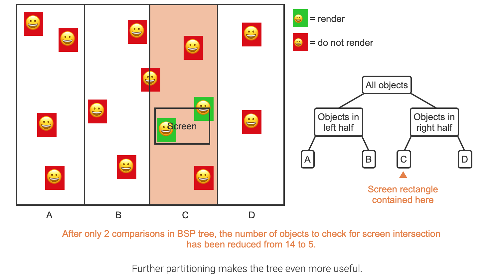

## Table of Contents
<ul>
	<li><a href="#tree">Tree</a></li>
</ul>

### Tree
#### full

> A binary tree is full if every node contains 0 or 2 children.

#### complete

> A binary tree is complete if all levels, except possibly the last level, are completely full and all nodes in the last level are as far left as possible.

#### perfect

> A binary tree is perfect, if all internal nodes have 2 children and all leaf nodes are at the same level.

#### BSP (Binary Space Partitioning)

 </img>

#### BST (Binary Search Tree)
**Traversal**: 

- left current right (asc)
- right current left (desc)

#### AVL tree

- An AVL tree is a BST with a height balance property and specific operations to rebalance the tree when a node is inserted or removed. This section discusses the balance property; another section discusses the operations. A BST is height balanced if for any node, the heights of the node's left and right subtrees differ by only 0 or 1.
- a tree (or subtree) with just one node has height 0. For calculating a balance factor, a non-existent left or right child's subtree's height is said to be -1.
- AVL tree's worst case height is no worse than about 1.5x the minimum binary tree height, so the height is still O(log N) where N is the number of nodes. Furthermore, experiments show that AVL tree heights in practice are much closer to the minimum.
               